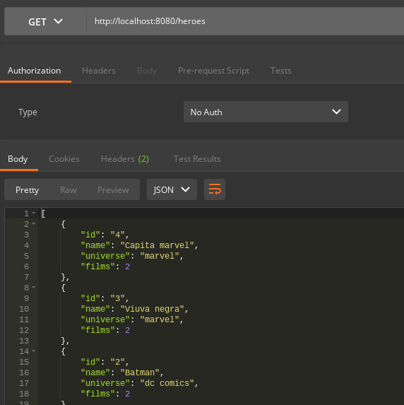
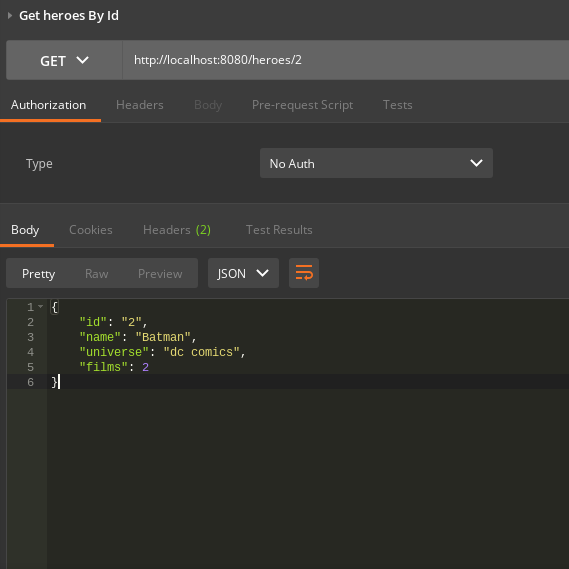
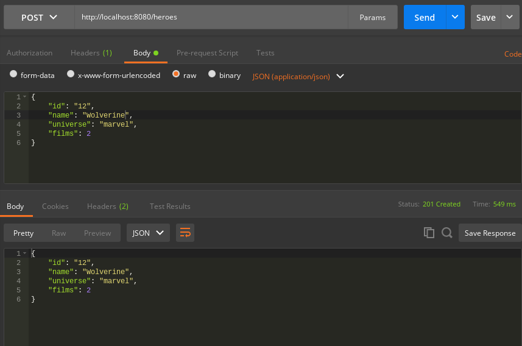
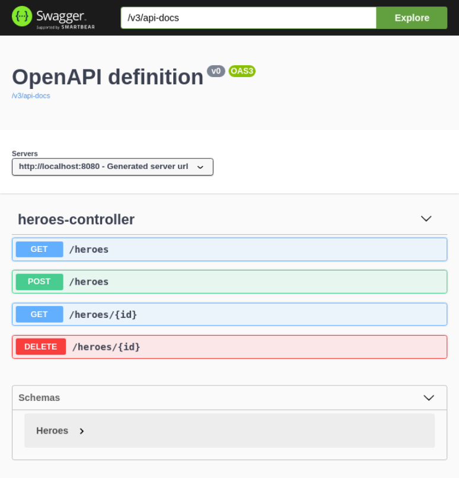
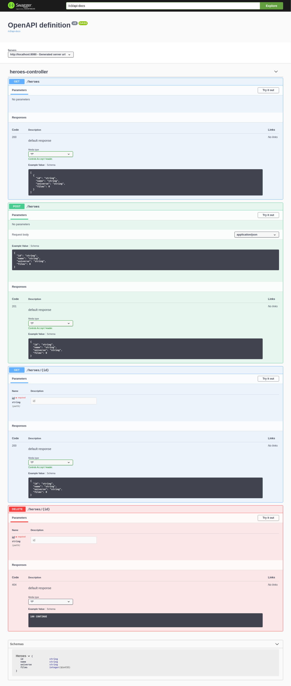

# Heroes API reativa com Spring Boot

*Gerenciador de super heróis da Marvel e da DC em uma API reativa com Spring Boot*

Projeto de uma API reativa com Spring Boot, Spring WebFlux, library reativa Reactor, banco DynamoDB, testes unitários com JUnit, Postman e Swagger.

#### AWS CLI: versão 2

Links de referência que me ajudaram na configuração da AWS CLI

- https://docs.aws.amazon.com/pt_br/general/latest/gr/aws-sec-cred-types.html#access-keys-and-secret-access-keys
- https://docs.aws.amazon.com/pt_br/elasticbeanstalk/latest/dg/eb-cli3-install.html

#### DynamoDB local

https://docs.aws.amazon.com/pt_br/amazondynamodb/latest/developerguide/DynamoDBLocal.DownloadingAndRunning.html

Para iniciar o DynamoDB em seu computador, abra uma janela de prompt de comando, vá até o diretório onde você extraiu o `DynamoDBLocal.jar` e insira o seguinte comando.

```shell
java -Djava.library.path=./DynamoDBLocal_lib -jar DynamoDBLocal.jar -sharedDb
```

Acessando as tabelas

```shell
aws dynamodb list-tables --endpoint-url http://localhost:8000
```

#### Postman

- Primeira requisição GET e criação da collection retornando os dados criados no arquivo `HeroesData.java`



- Get heroes by Id



- Create new hero




- Link da collection

https://documenter.getpostman.com/view/11187410/TzCL9UDd


#### Testes JUnit

```java
	@Test
    public void getOneHeroeById() {
        webTestClient.get().uri(HEROES_ENDPOINT_LOCAL.concat("/{id}"), "12")
                .exchange()
                .expectStatus().isOk()
                .expectBody();
    }

    @Test
    public void getOneHeronotFound() {
        webTestClient.get().uri(HEROES_ENDPOINT_LOCAL.concat("/{id}"), "10")
                .exchange()
                .expectStatus().isNotFound();
    }

    @Test
    public void deleteHero() {
        webTestClient.delete().uri(HEROES_ENDPOINT_LOCAL.concat("/{id}"), "12")
                .accept(MediaType.APPLICATION_JSON)
                .exchange()
                .expectStatus().isNotFound()
                .expectBody(Void.class);
    }
```

#### Swagger



